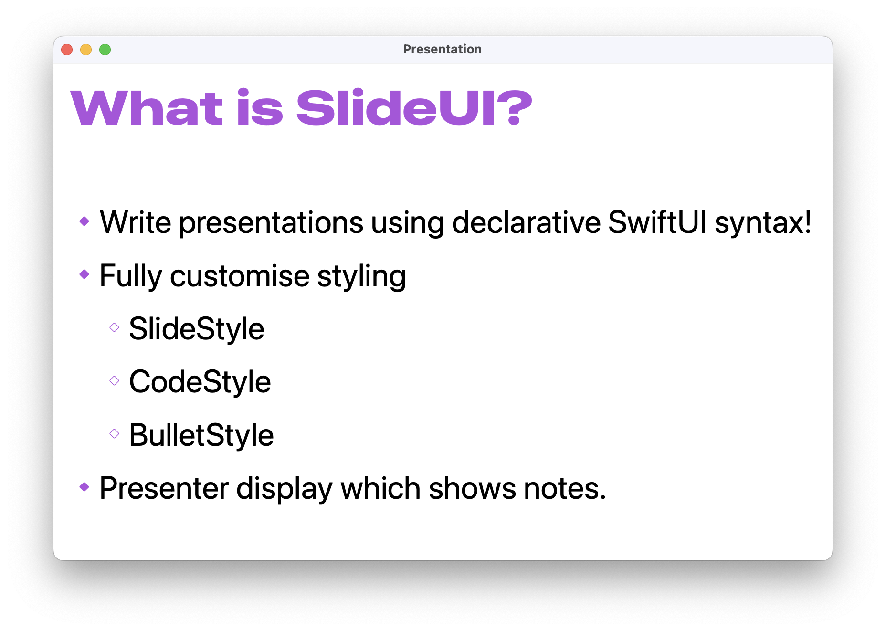
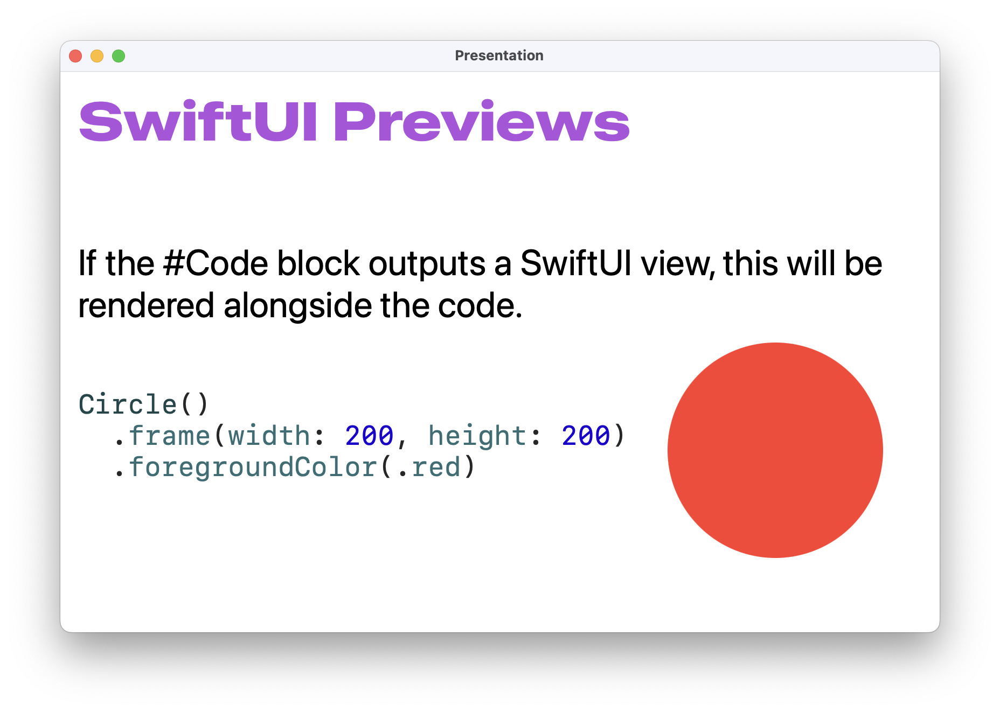

# SlideUI

Write presentations using declarative SwiftUI syntax.





## Installation

To use SlideUI in a Swift Package, add it to the dependencies clause in your Package.swift:

```swift
dependencies: [
  .package(url: "https://github.com/danielctull/SlideUI”, branch: "main")
]
```
